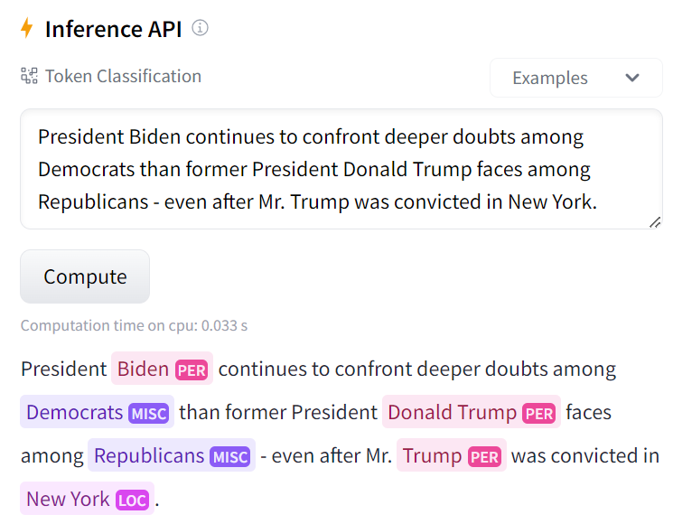

In this [experiment](token-classification.ipynb), I followed an NLP tutorial on HuggingFace to finetune a pretrained BERT model on Named Entity Recognition task. The code was mostly from the [HuggingFace tutorial](https://huggingface.co/learn/nlp-course/chapter7/2?fw=pt). For learning purpose, I added some comments to explain the purpose of the code and some cells to check the content the nested data objects, which other learners may refer to if necessary.

The dataset used for finetuning was the `CoNLL-2003` dataset, which contains news stories from **Reuters**. As instructed in the HuggingFace tutorial, the main data processing step was to prepare the data so that the pretrained BERT model can learn classify each token. Because the original words might be separated into multiple tokens, the ground-truth labels (LOC, PER, ORG, etc.) also needs to be repeated into multiple tokens when their original words are tokenized into multiple tokens. Thus, for each tokenized input sequence, a label sequence of the same length and with the same padding mask is also prepared, so that the loss computation can be performed correctly.

The finetuned Named Entity Recognition model can be tested [here](https://huggingface.co/thuann2cats/bert-finetuned-ner-HF-tutorial-using-Trainer), thanks to HuggingFace's awesome Inference API.

